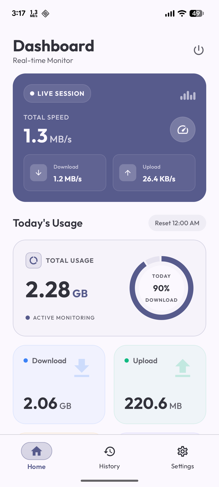
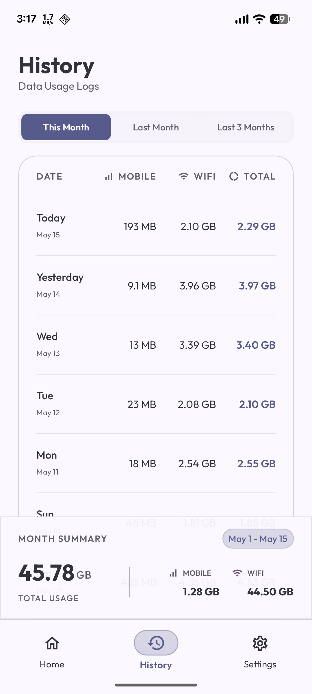
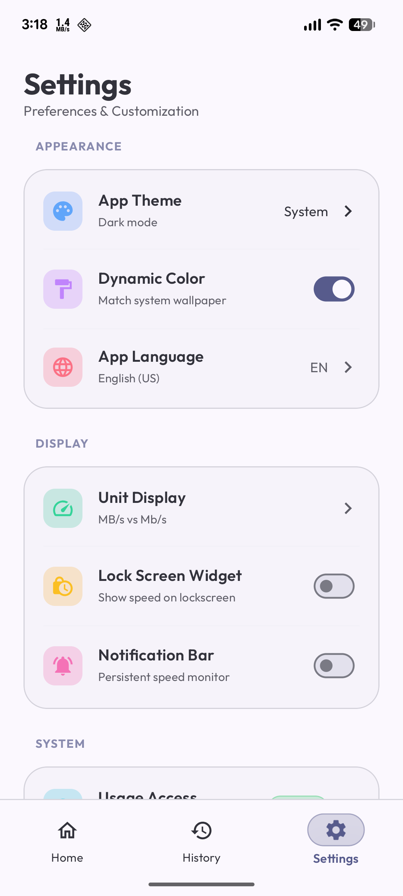

# NetSpeed Indicator 🚀

<div align="center">


[](https://buymeacoffee.com/ronyaburaihan)

**A modern, feature-rich Android application for real-time network speed monitoring and data usage tracking**

[Features](#-features) • [Screenshots](#-screenshots) • [Architecture](#-architecture) • [Installation](#-installation) • [Contributing](#-contributing) • [License](#-license)

</div>

---

## 📱 Overview

NetSpeed Indicator is a powerful Android application that provides real-time network speed monitoring and comprehensive data usage tracking. Built with modern Android development practices, it offers a beautiful Material Design 3 UI with support for both light and dark themes, dynamic colors, and a seamless user experience.

### ✨ Key Highlights

- 🎯 **Real-time Speed Monitoring** - Track download and upload speeds with live updates
- 📊 **Data Usage Analytics** - Monitor daily and monthly data consumption
- 🌓 **Material Design 3** - Beautiful UI with dynamic theming and dark mode
- 🏗️ **Clean Architecture** - Maintainable, testable, and scalable codebase
- 🔋 **Battery Optimized** - Efficient background service with minimal battery impact
- 🚀 **Modern Tech Stack** - Jetpack Compose, Kotlin Coroutines, Hilt, Room

---

## 🎯 Features

### Core Features

#### 🌐 Real-Time Speed Monitoring
- Live download and upload speed tracking
- Total speed calculation and display
- Persistent notification with speed information
- Visual speed indicators with animations
- Historical peak speed tracking

#### 📈 Data Usage Tracking
- Daily data usage monitoring (WiFi and Mobile separately)
- Monthly usage statistics and trends
- Automatic data categorization (Download/Upload)
- Usage history with detailed breakdowns
- Reset at midnight for accurate daily tracking

#### 🎨 Beautiful User Interface
- Material Design 3 implementation
- Dynamic color support (Material You)
- Light and dark theme support
- Smooth animations and transitions
- Intuitive navigation and layout
- Custom font family (Outfit)

#### ⚙️ Advanced Settings
- Theme customization (Light/Dark/System)
- Dynamic color toggle
- Lock screen notification control
- Upload speed display toggle
- Battery optimization settings
- Auto-start permission management

#### 🔔 Smart Notifications
- Persistent foreground notification
- Real-time speed updates in notification
- Data usage summary
- Signal strength indicator
- Customizable notification visibility

#### 🔄 Background Service
- Reliable foreground service
- Automatic restart after device reboot
- WorkManager health checks
- Crash-resistant implementation
- Graceful error handling

---

## 📸 Screenshots

<div align="center">

| Dashboard                               | History                             | Settings                              |
|-----------------------------------------|-------------------------------------|---------------------------------------|
|  |  |  |

*Beautiful Material Design 3 UI with dynamic theming*

</div>

---

## 🏗️ Architecture

NetSpeed Indicator follows **Clean Architecture** principles with **MVVM** pattern, ensuring a maintainable, testable, and scalable codebase.

### Architecture Layers

```
┌─────────────────────────────────────────┐
│         Presentation Layer              │
│  (UI, ViewModels, Navigation)           │
│  • Jetpack Compose                      │
│  • Material Design 3                    │
│  • Type-safe Navigation                 │
└──────────────┬──────────────────────────┘
               │
┌──────────────▼──────────────────────────┐
│          Domain Layer                   │
│  (Business Logic, Use Cases)            │
│  • Pure Kotlin                          │
│  • Framework Independent                │
│  • Repository Interfaces                │
└──────────────┬──────────────────────────┘
               │
┌──────────────▼──────────────────────────┐
│           Data Layer                    │
│  (Repositories, Data Sources)           │
│  • Room Database                        │
│  • DataStore Preferences                │
│  • Android APIs (TrafficStats, etc.)    │
└─────────────────────────────────────────┘
```

### Project Structure

```
app/src/main/java/com/englesoft/netspeedindicator/
├── presentation/              # UI Layer (MVVM)
│   ├── app/                  # Application-level components
│   ├── screen/               # Feature screens
│   │   ├── main/
│   │   │   ├── home/        # Dashboard screen
│   │   │   ├── history/     # Usage history
│   │   │   └── settings/    # App settings
│   │   └── onboarding/      # Onboarding flow
│   ├── component/            # Reusable UI components
│   ├── navigation/           # Navigation setup
│   └── theme/                # UI theming
│
├── domain/                   # Business Logic Layer
│   ├── model/               # Domain entities
│   ├── repository/          # Repository contracts
│   └── usecase/             # Business operations
│
├── data/                     # Data Layer
│   ├── datasource/          # Data sources
│   ├── local/               # Local storage (Room)
│   ├── mapper/              # Data transformation
│   ├── manager/             # State managers
│   ├── preferences/         # SharedPreferences
│   └── repository/          # Repository implementations
│
└── core/                     # Cross-cutting concerns
    ├── di/                  # Dependency Injection
    ├── service/             # Android services
    ├── receiver/            # Broadcast receivers
    └── util/                # Utilities
```

### Key Architectural Components

#### 1. **Clean Architecture Benefits**
- ✅ **Separation of Concerns** - Each layer has a single responsibility
- ✅ **Testability** - Easy to unit test each layer independently
- ✅ **Maintainability** - Changes in one layer don't affect others
- ✅ **Scalability** - Easy to add new features
- ✅ **Independence** - UI, database, and frameworks are independent

#### 2. **MVVM Pattern**
- **Model** - Domain entities and business logic
- **View** - Jetpack Compose UI components
- **ViewModel** - State management and UI logic

#### 3. **Result Wrapper**
Consistent error handling across all layers:
```kotlin
sealed class Result<out T> {
    data class Success<T>(val data: T) : Result<T>()
    data class Error(val message: String, val code: Int? = null) : Result<Nothing>()
    data object Loading : Result<Nothing>()
}
```

---

## 🛠️ Tech Stack

### Core Technologies
- **Language**: Kotlin 100%
- **UI Framework**: Jetpack Compose
- **Architecture**: Clean Architecture + MVVM
- **Dependency Injection**: Hilt
- **Async Programming**: Kotlin Coroutines & Flow

### Android Jetpack
- **Compose**: Declarative UI framework
- **ViewModel**: Lifecycle-aware state management
- **Room**: Local database
- **DataStore**: Preferences storage
- **Navigation**: Type-safe navigation
- **WorkManager**: Background task scheduling

### Libraries & Tools
- **Material Design 3**: Modern design system
- **Kotlin Serialization**: JSON serialization
- **TrafficStats API**: Network speed monitoring
- **NetworkStatsManager**: Detailed usage statistics

### Build & Development
- **Gradle KTS**: Kotlin DSL build scripts
- **Version Catalogs**: Centralized dependency management
- **KSP**: Kotlin Symbol Processing
- **Min SDK**: 28 (Android 9.0)
- **Target SDK**: 36 (Android 15)

---

## 📦 Installation

### Prerequisites
- Android Studio Ladybug or later
- JDK 11 or later
- Android SDK 28 or later
- Gradle 8.0 or later

### Setup Instructions

1. **Clone the repository**
   ```bash
   git clone https://github.com/ronyaburaihan/NetSpeedIndicator.git
   cd netspeed-indicator
   ```

2. **Open in Android Studio**
   - Open Android Studio
   - Select "Open an Existing Project"
   - Navigate to the cloned directory
   - Wait for Gradle sync to complete

3. **Build the project**
   ```bash
   ./gradlew build
   ```

4. **Run on device/emulator**
   ```bash
   ./gradlew installDebug
   ```

### Required Permissions

The app requires the following permissions:

- **INTERNET** - Network access
- **ACCESS_NETWORK_STATE** - Network state monitoring
- **ACCESS_WIFI_STATE** - WiFi state monitoring
- **FOREGROUND_SERVICE** - Background monitoring
- **POST_NOTIFICATIONS** - Notification display (Android 13+)
- **PACKAGE_USAGE_STATS** - Detailed usage statistics (requires manual grant)
- **RECEIVE_BOOT_COMPLETED** - Auto-start after reboot
- **REQUEST_IGNORE_BATTERY_OPTIMIZATIONS** - Reliable background operation

---

## 🚀 Usage

### First Launch
1. Grant necessary permissions when prompted
2. Enable "Usage Access" permission in settings
3. Optionally disable battery optimization for reliable monitoring
4. The service starts automatically and begins monitoring

### Dashboard
- View real-time download and upload speeds
- Monitor today's total data usage
- See breakdown by WiFi and Mobile data
- Track download and upload separately

### History
- View daily usage for current month
- Switch between current month, last month, and last 3 months
- See detailed breakdown for each day
- Monthly summary with total usage

### Settings
- Customize app theme (Light/Dark/System)
- Enable/disable dynamic colors
- Control lock screen notification visibility
- Toggle upload speed display
- Manage battery optimization
- Configure auto-start permission

### Stopping the Service
- Tap the power button in the top-right corner
- Confirm to stop monitoring and close the app
- Service stops gracefully and saves all data

---

## 🔧 Configuration

### Build Variants
- **Debug**: Development build with logging
- **Release**: Production build with ProGuard

### Customization

#### Change App Theme
```kotlin
// In SettingsScreen
viewModel.setAppTheme(theme)
// 0 = System, 1 = Light, 2 = Dark
```

#### Adjust Monitoring Interval
```kotlin
// In SpeedMonitorService.kt
private const val SAVE_INTERVAL_MS = 60_000L // 1 minute
private const val OPERATION_TIMEOUT_MS = 5_000L // 5 seconds
```

#### Modify WorkManager Health Check
```kotlin
// In ServiceHelper.kt
val workRequest = PeriodicWorkRequestBuilder<ServiceRestartWorker>(
    15, // Minutes
    TimeUnit.MINUTES
).build()
```

---

## 🧪 Testing

### Run Unit Tests
```bash
./gradlew test
```

### Run Instrumented Tests
```bash
./gradlew connectedAndroidTest
```

### Test Coverage
- Unit tests for ViewModels
- Unit tests for Use Cases
- Unit tests for Repositories
- Integration tests for database operations

---

## 📊 Performance

### Optimizations
- **Efficient Data Collection**: Minimal CPU usage
- **Smart Caching**: Reduces database queries
- **Lazy Loading**: Loads data on demand
- **Coroutine Optimization**: Non-blocking operations
- **Memory Management**: No memory leaks

### Battery Impact
- **Minimal Battery Drain**: ~1-2% per day
- **Optimized Notifications**: Updates only when needed
- **Smart Scheduling**: WorkManager for health checks
- **Doze Mode Compatible**: Survives battery optimization

---

## 🤝 Contributing

Contributions are welcome! Please follow these guidelines:

### How to Contribute

1. **Fork the repository**
2. **Create a feature branch**
   ```bash
   git checkout -b feature/amazing-feature
   ```
3. **Follow the coding standards**
   - Use Kotlin coding conventions
   - Follow Clean Architecture principles
   - Write meaningful commit messages
   - Add comments for complex logic
4. **Write tests**
   - Add unit tests for new features
   - Ensure existing tests pass
5. **Commit your changes**
   ```bash
   git commit -m 'Add amazing feature'
   ```
6. **Push to the branch**
   ```bash
   git push origin feature/amazing-feature
   ```
7. **Open a Pull Request**

### Code Style
- Follow [Kotlin Coding Conventions](https://kotlinlang.org/docs/coding-conventions.html)
- Use meaningful variable and function names
- Keep functions small and focused
- Add KDoc comments for public APIs
- Maintain Clean Architecture separation

### Reporting Issues
- Use the issue tracker to report bugs
- Provide detailed reproduction steps
- Include device information and Android version
- Attach logs if applicable

---

## 🐛 Known Issues

Currently, there are no known critical issues. For minor issues and feature requests, please check the [Issues](https://github.com/ronyaburaihan/NetSpeedIndicator/issues) page.

---

## 📄 License

This project is licensed under the MIT License - see the [LICENSE](LICENSE) file for details.

```
MIT License

Copyright (c) 2026@ronyaburaihan

Permission is hereby granted, free of charge, to any person obtaining a copy
of this software and associated documentation files (the "Software"), to deal
in the Software without restriction, including without limitation the rights
to use, copy, modify, merge, publish, distribute, sublicense, and/or sell
copies of the Software, and to permit persons to whom the Software is
furnished to do so, subject to the following conditions:

The above copyright notice and this permission notice shall be included in all
copies or substantial portions of the Software.

THE SOFTWARE IS PROVIDED "AS IS", WITHOUT WARRANTY OF ANY KIND, EXPRESS OR
IMPLIED, INCLUDING BUT NOT LIMITED TO THE WARRANTIES OF MERCHANTABILITY,
FITNESS FOR A PARTICULAR PURPOSE AND NONINFRINGEMENT. IN NO EVENT SHALL THE
AUTHORS OR COPYRIGHT HOLDERS BE LIABLE FOR ANY CLAIM, DAMAGES OR OTHER
LIABILITY, WHETHER IN AN ACTION OF CONTRACT, TORT OR OTHERWISE, ARISING FROM,
OUT OF OR IN CONNECTION WITH THE SOFTWARE OR THE USE OR OTHER DEALINGS IN THE
SOFTWARE.
```

---

## 👨‍💻 Author

**Abu Raihan Rony**

- GitHub: [@ronyaburaihan](https://github.com/ronyaburaihan)
- LinkedIn: [Abu Raihan Rony](https://linkedin.com/in/ronyaburaihan)
- Email: ronyaburaihan@gmail.com

---

## 💖 Support

If you find this project helpful, please consider:

- ⭐ **Starring the repository**
- 🐛 **Reporting bugs**
- 💡 **Suggesting new features**
- 🔀 **Contributing code**
- ☕ **Buying me a coffee**

<div align="center">

[](https://buymeacoffee.com/ronyaburaihan)

**Your support helps maintain and improve this project!**

</div>

---

## 🙏 Acknowledgments

- **Android Team** - For excellent Jetpack libraries
- **Material Design Team** - For beautiful design guidelines
- **Kotlin Team** - For the amazing programming language
- **Open Source Community** - For inspiration and support
- **Contributors** - For making this project better

---

## 📞 Contact & Support

### Get Help
- 🐛 [Issue Tracker](https://github.com/ronyaburaihan/NetSpeedIndicator/issues)
- 📧 Email: ronyaburaihan@gmail.com

### Stay Updated
- ⭐ Star this repository to get notifications
- 👀 Watch for new releases
- 🔔 Follow for updates

---

## 📈 Project Stats


---

<div align="center">

**Made with ❤️ using Clean Architecture and Jetpack Compose**

**If you like this project, please give it a ⭐!**

[⬆ Back to Top](#netspeed-indicator-)

</div>
